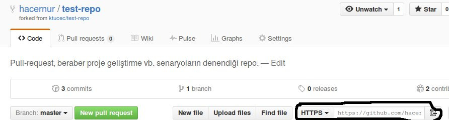
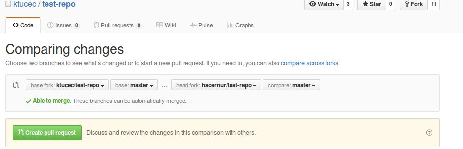
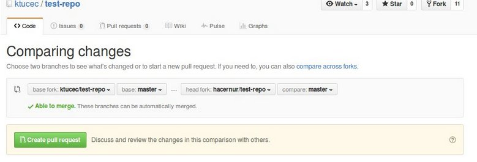

# test-repo
Pull-request, beraber proje geliştirme vb. senaryoların denendiği repo.

Pull request, projenin geliştiricilerine yaptığınız değişiklikleri onaylarına sunmanızı sağlayan bir tekniktir.
Bunun için aşağıdaki adımları yapmakla başlayalım.

İlk olarak repo forklanır.

Forkladıktan sonra repo sizin repolarınıza eklenmiştir.

Değişiklikleri yapabilmek için repoyu lokalinize çekmeniz gerekmektedir.
Aşağıdaki resimde gösterilen adresi kopyaladıktan sonra sırasıyla aşağıdaki adımları yapalım.

* cd Github
 // Github dizinin içerisine girilir.

* git clone https://github.com/hacernur/test-repo.git
 // Kopyalanılan adress

Bu şekilde repo bulunulan dizine çoğaltılır.

Bundan sonra yapmak istediğiniz değişiklikleri yapıp commitleyebilirsiniz.

Aşağıdaki şekilde hacernur adlı bir python dosyası oluşturdum.

* nano hacernur.py
// Dosya adını kendi isminiz olarak değiştirip içeriğini istediğiniz şekilde doldurabilirsiniz.

* git add hacernur.py
* git commit -m "hacernur dosyası oluşturuldu."
* git push origin master

Yapılan değişiklikler repoya aktarıldı.
Şimdi bu yapılan commitler için projenin geliştiricisine aşağıdaki şekilde pull-request açıcağız.

Buradan işaret edilen linke tıklanır.

Ve ** new pull request ** butonuna tıklanır.

Gelen sayfadaki commitlerin sizin tarafınızdan eklenmiş olduğu kontrol edildikten sonra **create pull request** diyerek pull-request açılmış olunur.

