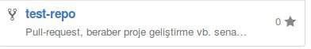
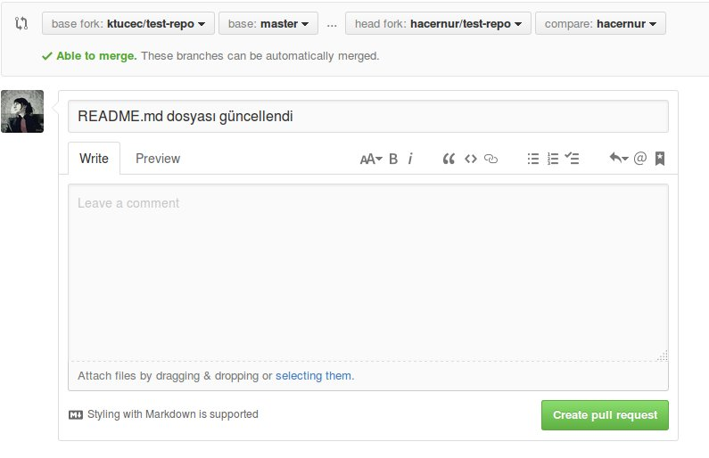

# test-repo
Pull-request, beraber proje geliştirme vb. senaryoların denendiği repo.

Pull request, projenin geliştiricilerine yaptığınız değişiklikleri onaylarına sunmanızı sağlayan bir tekniktir.
Bunun için aşağıdaki adımları yapmakla başlayalım.

İlk olarak repo forklanır.

Forkladıktan sonra repo sizin repolarınıza eklenmiştir.

Değişiklikleri yapabilmek için repoyu lokalinize çekmeniz gerekmektedir.
Aşağıdaki resimde gösterilen adresi kopyaladıktan sonra sırasıyla aşağıdaki adımları yapalım.

* mkdir Github/Test-Repo
 // Github dizini altında Test-Repo dizinini oluşturur.

* cd Test-Repo
// Dizinin içerisine girilir.

* git clone https://github.com/hacernur/test-repo.git
 // Kopyalanılan adress

Bu şekilde repo bulunulan dizine çoğaltılır.

Bundan sonra yeni bir branch oluşturup; o brancha geçiş yaptıktan sonra istediğiniz değişiklikleri yapıp commitleyebilirsiniz.

* git checkout -b hacernur
// hacernur adlı branch oluşturup dala geçiş yaptım.

* nano hacernur.py
// içeriğini istediğiniz gibi doldurabilirsiniz.

* git add hacernur.py
* git commit -m "README.md dosyası güncellendi"
* git push origin hacernur

Yapılan değişiklikler repoya aktarıldı.
Şimdi bu yapılan commitler için projenin geliştiricisine aşağıdaki şekilde pull-request açıcağız.

Resimde görüldüğü üzere ** create pull request **  butonuna tıklanır.

Gelen sayfadaki commitlerin sizin tarafınızdan eklenmiş olduğu kontrol edildikten sonra **create pull request** diyerek pull-request açılmış olunur.

